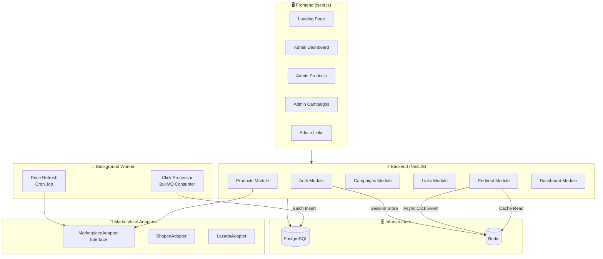

# Jenosize Affiliate Platform

> Affiliate web app for promotion & marketplace price comparison (Lazada / Shopee)

## 🏗️ Architecture



## 🚀 Quick Start

### Prerequisites
- Node.js ≥ 20
- Docker & Docker Compose

### 1. Clone & Install
```bash
git clone <repo-url>
cd Jenosize_LeadEngineer_AffiliatePlatform
cp .env.example .env
npm install
```

### 2. Start Infrastructure
```bash
docker compose -f infra/docker-compose.yml up postgres redis -d
```

### 3. Database Setup
```bash
npm run db:generate
npm run db:migrate
npm run db:seed    # Optional: loads sample data
```

### 4. Run Development
```bash
# Terminal 1: API (http://localhost:8080)
npm run dev:api

# Terminal 2: Web (http://localhost:3000)
npm run dev:web
```

### 5. Access
- **Public Site**: http://localhost:3000
- **Admin Panel**: http://localhost:3000/admin/dashboard
- **API Docs (Swagger)**: http://localhost:8080/api/docs

## 📦 Project Structure

```
/apps
  /api              # NestJS Backend API
  /web              # Next.js Frontend
/packages
  /adapters         # Marketplace adapter interface & mock implementations
  /database         # Prisma ORM schema, migrations, seed
/infra
  docker-compose.yml
```

## 🛠️ Tech Stack

| Layer | Technology |
|-------|-----------|
| Frontend | Next.js 15 (App Router) + TailwindCSS |
| Backend | NestJS + TypeScript |
| Database | PostgreSQL 16 (Prisma ORM) |
| Cache & Queue | Redis 7 + BullMQ |
| Auth | JWT (HTTP-only cookies, SameSite=strict) |
| Testing | Jest (unit + integration + e2e) |
| CI/CD | GitHub Actions |
| Infra | Docker Compose |

## 🔑 Key Architectural Decisions

### Adapter Pattern
The `MarketplaceAdapter` interface in `/packages/adapters` allows plugging in new marketplaces without changing core logic. To add TikTok Shop, you'd just create a `TiktokAdapter` implementing the interface and register it in `AdapterFactory`.

### High-Throughput Redirects
`GET /go/:short_code` is the critical high-traffic path. It:
1. Reads the target URL from **Redis cache** (fast path)
2. Falls back to PostgreSQL on cache miss
3. Pushes click event to a **BullMQ queue** (fire-and-forget)
4. Returns HTTP 302 immediately — no synchronous DB write

### Async Click Processing
The BullMQ worker consumes click events and batch-inserts into PostgreSQL, decoupled from the redirect response time.

### Cookie-Based Auth
Access & refresh tokens stored in HTTP-only cookies with `SameSite=strict` — no tokens in localStorage. Refresh tokens are stored in Redis for revocation support.

## 🧪 Testing

```bash
# Adapter unit tests
npm run test -w packages/adapters

# API unit tests
npm run test -w apps/api

# API e2e tests (requires Postgres + Redis)
npm run test:e2e -w apps/api
```

## 🐳 Docker (Full Stack)

```bash
docker compose -f infra/docker-compose.yml up --build
```

This starts all 4 services: PostgreSQL, Redis, API (port 8080), Web (port 3000).

## 🔮 Future Roadmap

- **Real marketplace APIs**: Replace mock adapters with actual Shopee/Lazada Open Platform integrations
- **Rate limiting**: Add rate limiting to the redirect endpoint
- **A/B testing**: Support multiple target URLs per link for split testing
- **Webhook notifications**: Alert on price drops
- **Analytics export**: CSV/PDF report generation
- **Multi-tenancy**: Support multiple brands/teams
