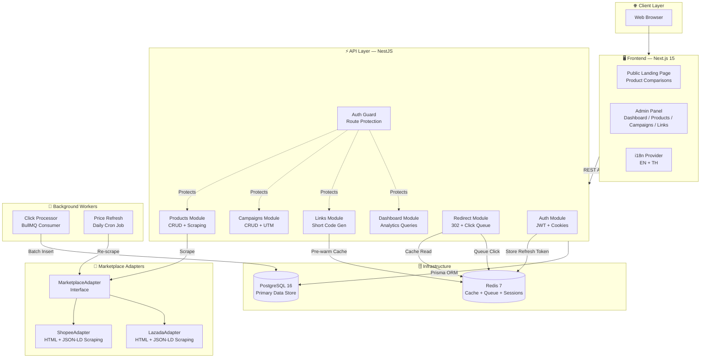

# 03 — System Architecture

## 1. High-Level Architecture



---

## 2. Technology Stack

| Layer | Technology | Version | Purpose |
|-------|-----------|---------|---------|
| **Frontend** | Next.js | 15.x | App Router, SSR/CSR, React 19 |
| **Styling** | Tailwind CSS | 4.x | Utility-first CSS framework |
| **Backend** | NestJS | 11.x | Modular REST API framework |
| **Language** | TypeScript | 5.x | Type-safe development |
| **ORM** | Prisma | 6.x | Database schema, migrations, queries |
| **Database** | PostgreSQL | 16 | Relational data store |
| **Cache/Queue** | Redis | 7 | Caching, BullMQ job queue, sessions |
| **Queue** | BullMQ | 5.x | Async click event processing |
| **Scheduler** | @nestjs/schedule | 5.x | Daily price refresh cron job |
| **Auth** | jsonwebtoken | — | JWT access + refresh tokens |
| **Scraping** | Cheerio | — | HTML parsing for marketplace data |
| **Testing** | Jest | 29.x | Unit, integration, e2e tests |
| **CI/CD** | GitHub Actions | — | Lint, test, build pipeline |
| **Containers** | Docker Compose | — | Local + production orchestration |
| **i18n** | Custom Context | — | React Context + dictionary pattern |

---

## 3. Module Architecture

```mermaid
graph LR
    subgraph NestJS["NestJS Application"]
        APP[AppModule]
        APP --> A[AuthModule]
        APP --> P[ProductsModule]
        APP --> C[CampaignsModule]
        APP --> L[LinksModule]
        APP --> R[RedirectModule]
        APP --> D[DashboardModule]
        APP --> W[WorkerModule]
        APP --> PR[PrismaModule]
        APP --> RE[RedisModule]
    end

    subgraph Shared["Shared"]
        PR -->|Global| PRISMA_SVC[PrismaService]
        RE -->|Global| REDIS_SVC[RedisService]
    end

    subgraph External["External Packages"]
        P -->|@affiliate/adapters| ADAPT[AdapterFactory]
        W -->|@affiliate/adapters| ADAPT
        PR -->|@affiliate/database| DB[Prisma Client]
    end
```

---

## 4. Monorepo Structure

```
Jenosize-AffiliatePlatform/
├── apps/
│   ├── api/                    # NestJS Backend
│   │   ├── src/
│   │   │   ├── auth/           # Authentication (JWT, guards, cookies)
│   │   │   ├── campaigns/      # Campaign CRUD
│   │   │   ├── config/         # Startup env validation
│   │   │   ├── dashboard/      # Analytics aggregation
│   │   │   ├── links/          # Short link generation
│   │   │   ├── prisma/         # Database service
│   │   │   ├── products/       # Product CRUD + scraping
│   │   │   ├── redirect/       # High-performance redirects
│   │   │   ├── redis/          # Redis service
│   │   │   ├── worker/         # BullMQ consumer + cron
│   │   │   ├── app.module.ts   # Root module
│   │   │   └── main.ts         # Bootstrap
│   │   └── test/               # E2E tests
│   └── web/                    # Next.js Frontend
│       ├── src/
│       │   ├── app/            # Pages (App Router)
│       │   │   ├── page.tsx           # Public landing
│       │   │   ├── layout.tsx         # Root layout + i18n provider
│       │   │   └── admin/             # Admin section
│       │   │       ├── layout.tsx     # Admin sidebar
│       │   │       ├── login/         # Login page
│       │   │       ├── dashboard/     # Analytics
│       │   │       ├── products/      # Product management
│       │   │       ├── campaigns/     # Campaign management
│       │   │       └── links/         # Link management
│       │   ├── components/     # LanguageSwitcher
│       │   └── lib/            # API helpers, i18n
│       └── public/             # Static assets
├── packages/
│   ├── adapters/               # Marketplace scraping adapters
│   │   ├── src/
│   │   │   ├── marketplace-adapter.interface.ts
│   │   │   ├── shopee.adapter.ts
│   │   │   ├── lazada.adapter.ts
│   │   │   └── adapter.factory.ts
│   │   └── __tests__/
│   └── database/               # Prisma schema + migrations
│       └── prisma/
│           ├── schema.prisma
│           ├── migrations/
│           └── seed.ts
├── infra/
│   └── docker-compose.yml      # Full-stack containerization
├── .github/
│   └── workflows/
│       └── ci.yml              # GitHub Actions pipeline
└── docs/                       # This documentation
```

---

## 5. Communication Patterns

| Pattern | Where Used | Description |
|---------|-----------|-------------|
| **REST API** | Frontend ↔ Backend | Standard HTTP methods with JSON payloads |
| **HTTP-only Cookies** | Auth | Access + refresh tokens stored securely in cookies |
| **Redis Cache** | Redirect flow | Short code → target URL mapping cached for fast lookups |
| **BullMQ Queue** | Click tracking | Click events fire-and-forget into Redis queue |
| **Cron Schedule** | Price refresh | `@Cron('0 0 * * *')` runs daily at midnight |
| **Adapter Pattern** | Marketplace scraping | Pluggable interface for different marketplace implementations |
