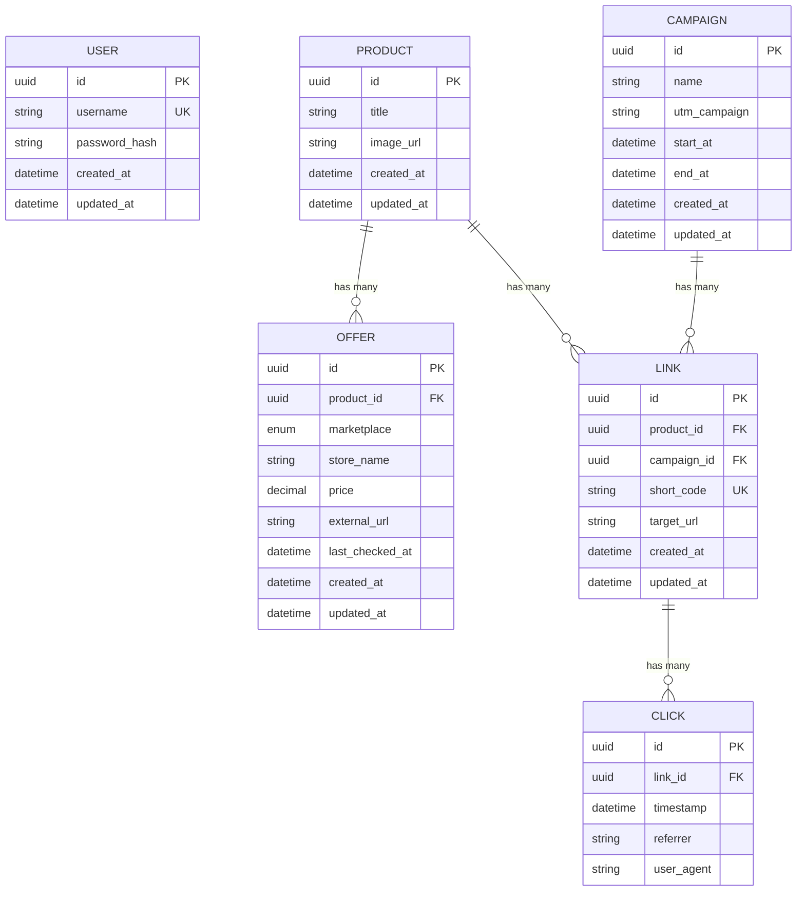
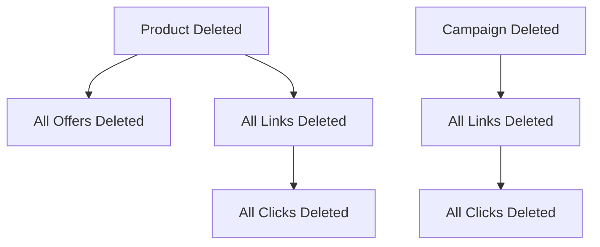

# 04 — Data Model

## 1. Entity-Relationship Diagram



---

## 2. Entity Descriptions

### 2.1 User
Stores admin credentials for the platform.

| Column | Type | Constraints | Description |
|--------|------|------------|-------------|
| `id` | UUID | PK, auto-generated | Unique identifier |
| `username` | VARCHAR | UNIQUE, NOT NULL | Login username |
| `password_hash` | VARCHAR | NOT NULL | bcrypt-hashed password |
| `created_at` | TIMESTAMP | DEFAULT now() | Account creation time |
| `updated_at` | TIMESTAMP | Auto-updated | Last modification time |

### 2.2 Product
Represents a tracked product (can have offers from multiple marketplaces).

| Column | Type | Constraints | Description |
|--------|------|------------|-------------|
| `id` | UUID | PK, auto-generated | Unique identifier |
| `title` | VARCHAR | NOT NULL | Product name (scraped from marketplace) |
| `image_url` | VARCHAR | NULLABLE | Product image URL |
| `created_at` | TIMESTAMP | DEFAULT now() | When product was added |
| `updated_at` | TIMESTAMP | Auto-updated | Last modification time |

**Relationships**: Has many `Offer`, Has many `Link`

### 2.3 Offer
A marketplace-specific price listing for a product.

| Column | Type | Constraints | Description |
|--------|------|------------|-------------|
| `id` | UUID | PK, auto-generated | Unique identifier |
| `product_id` | UUID | FK → Product, NOT NULL | Parent product |
| `marketplace` | ENUM | `SHOPEE` \| `LAZADA` | Source marketplace |
| `store_name` | VARCHAR | NOT NULL | Seller/store name |
| `price` | DECIMAL(12,2) | NOT NULL | Current price in THB |
| `external_url` | VARCHAR | NOT NULL | Direct link to marketplace listing |
| `last_checked_at` | TIMESTAMP | DEFAULT now() | When price was last refreshed |
| `created_at` | TIMESTAMP | DEFAULT now() | When offer was first scraped |
| `updated_at` | TIMESTAMP | Auto-updated | Last modification time |

**Cascade**: Deleted when parent Product is deleted.

### 2.4 Campaign
A promotional campaign with UTM tracking and date range.

| Column | Type | Constraints | Description |
|--------|------|------------|-------------|
| `id` | UUID | PK, auto-generated | Unique identifier |
| `name` | VARCHAR | NOT NULL | Human-readable campaign name |
| `utm_campaign` | VARCHAR | NOT NULL | UTM campaign parameter value |
| `start_at` | TIMESTAMP | NOT NULL | Campaign start date |
| `end_at` | TIMESTAMP | NOT NULL | Campaign end date |
| `created_at` | TIMESTAMP | DEFAULT now() | When campaign was created |
| `updated_at` | TIMESTAMP | Auto-updated | Last modification time |

**Relationships**: Has many `Link`

### 2.5 Link
A trackable short link mapping a product + campaign to a redirect URL.

| Column | Type | Constraints | Description |
|--------|------|------------|-------------|
| `id` | UUID | PK, auto-generated | Unique identifier |
| `product_id` | UUID | FK → Product, NOT NULL | Linked product |
| `campaign_id` | UUID | FK → Campaign, NOT NULL | Linked campaign |
| `short_code` | VARCHAR | UNIQUE, NOT NULL | Random 8-char short code |
| `target_url` | VARCHAR | NOT NULL | Destination URL (marketplace + UTM params) |
| `created_at` | TIMESTAMP | DEFAULT now() | When link was generated |
| `updated_at` | TIMESTAMP | Auto-updated | Last modification time |

**Cascade**: Deleted when parent Product or Campaign is deleted.

### 2.6 Click
Records each click on a tracked affiliate link.

| Column | Type | Constraints | Description |
|--------|------|------------|-------------|
| `id` | UUID | PK, auto-generated | Unique identifier |
| `link_id` | UUID | FK → Link, NOT NULL | Which link was clicked |
| `timestamp` | TIMESTAMP | DEFAULT now() | When the click occurred |
| `referrer` | VARCHAR | NULLABLE | HTTP Referer header |
| `user_agent` | VARCHAR | NULLABLE | Browser/device info |

**Cascade**: Deleted when parent Link is deleted.

---

## 3. Enumerations

### Marketplace
```
SHOPEE
LAZADA
```

---

## 4. Indexes

| Table | Column(s) | Type | Purpose |
|-------|----------|------|---------|
| `users` | `username` | UNIQUE | Fast login lookup |
| `links` | `short_code` | UNIQUE | Fast redirect lookup |
| `products` | `id` | PRIMARY | Standard PK index |
| `offers` | `product_id` | FOREIGN KEY | Join optimization |
| `clicks` | `link_id` | FOREIGN KEY | Aggregation queries |

---

## 5. Cascade Delete Chain


