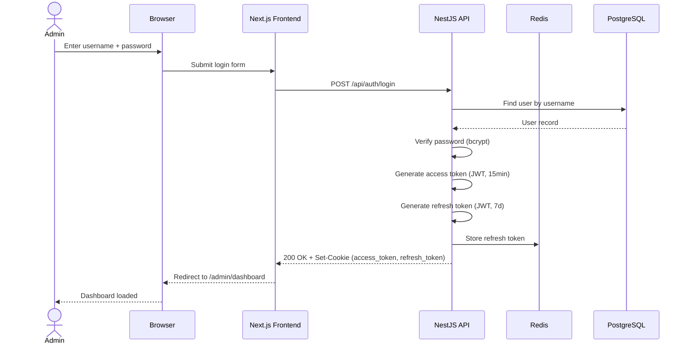
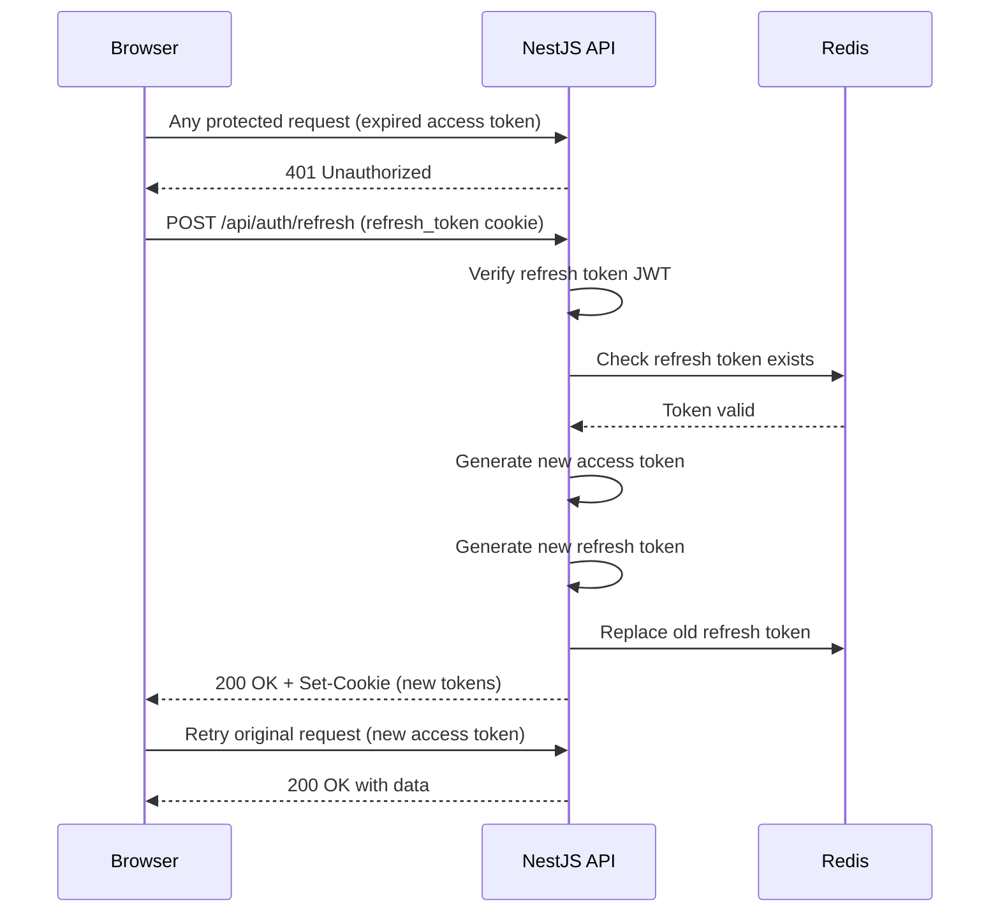
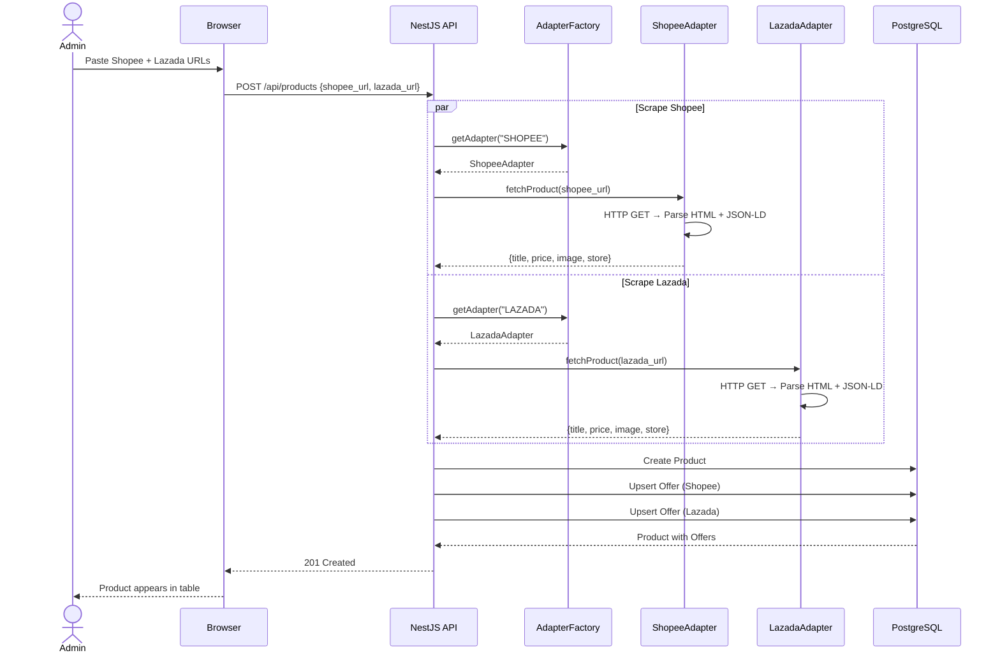
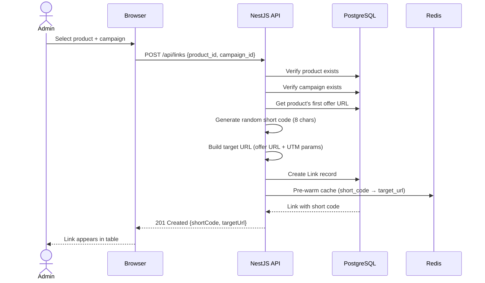
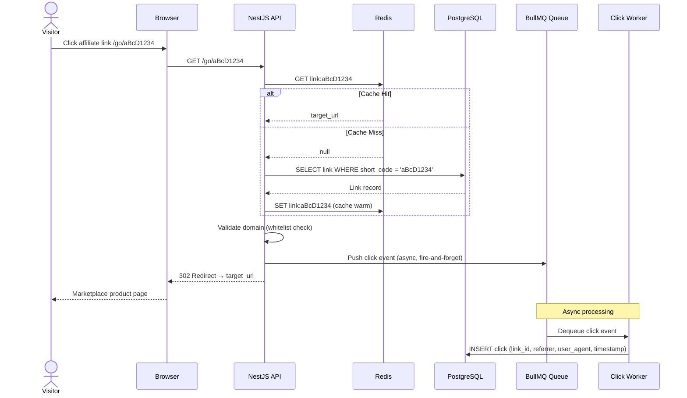
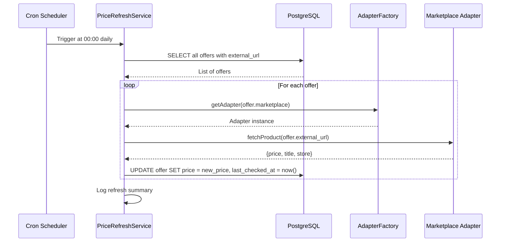
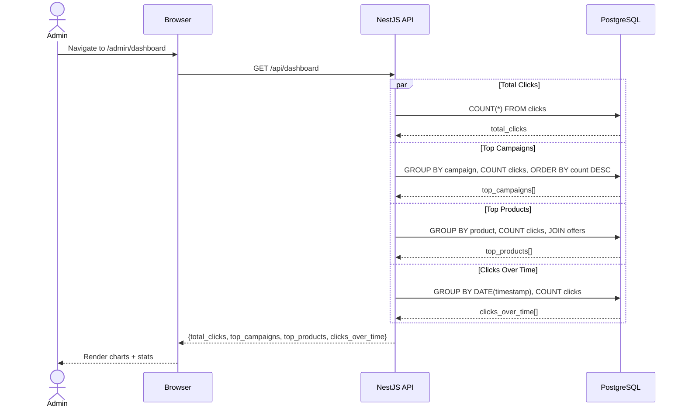

# 06 — Sequence Diagrams

## 1. User Login Flow

---

## 2. Token Refresh Flow

---

## 3. Product Creation Flow

---

## 4. Affiliate Link Generation Flow

---

## 5. Affiliate Redirect + Click Tracking Flow

---

## 6. Daily Price Refresh Flow

---

## 7. Dashboard Analytics Query Flow

