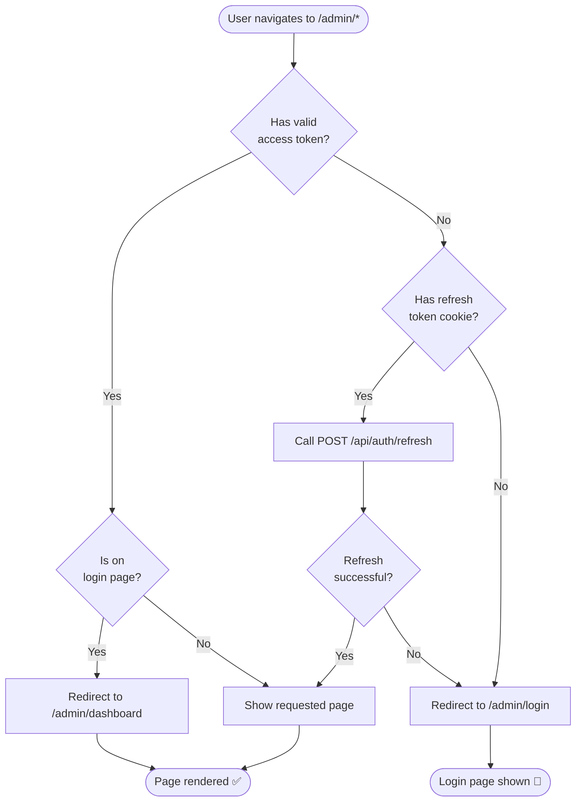
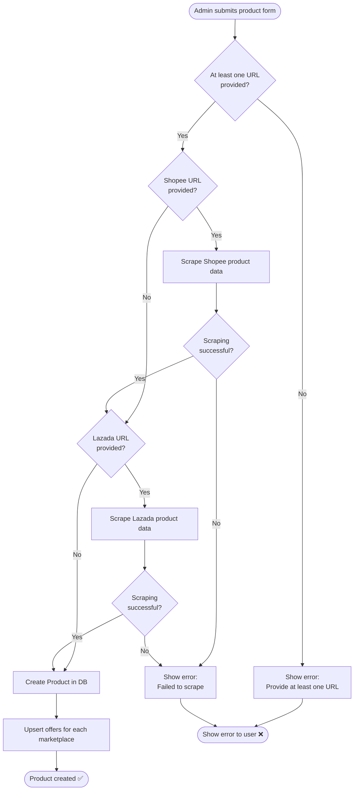
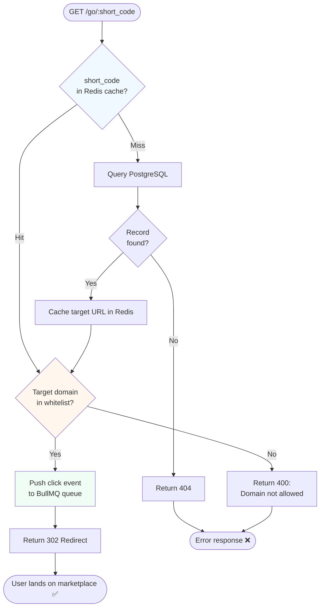
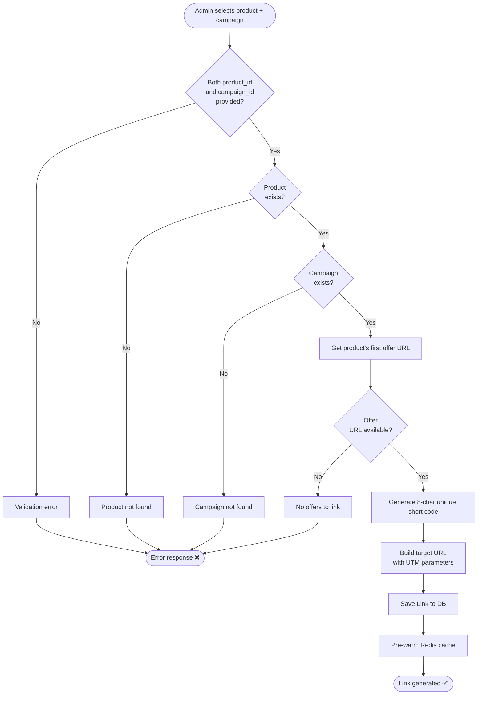
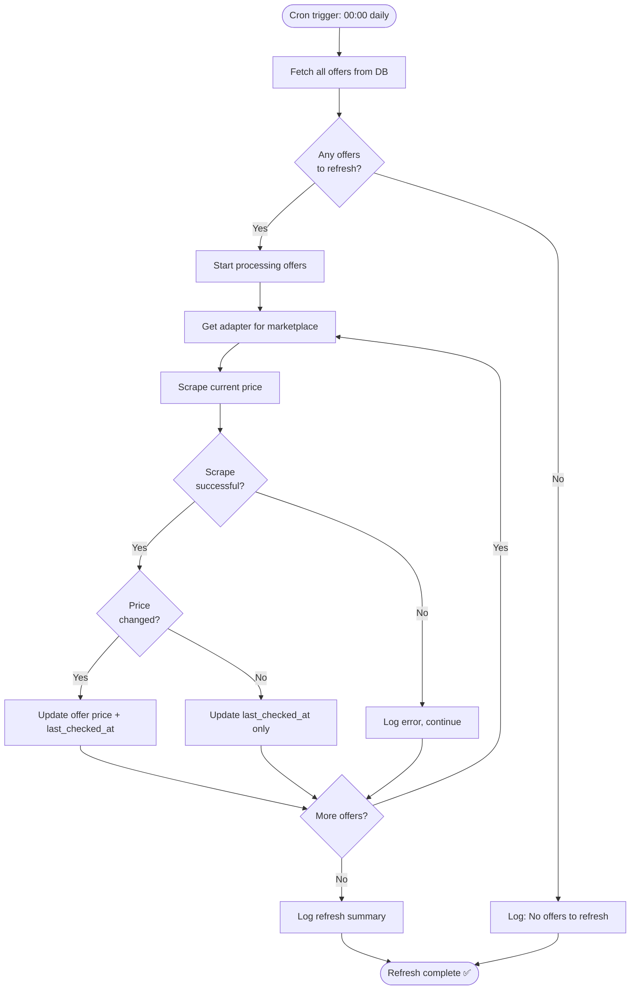
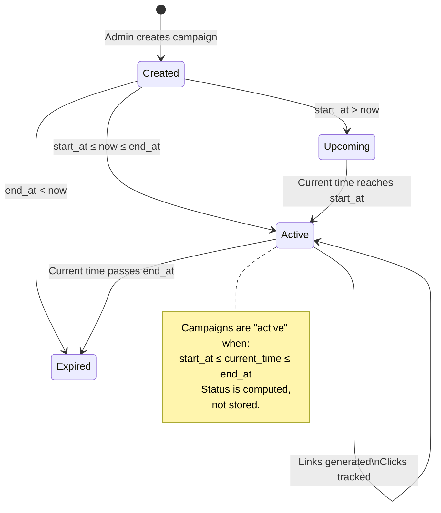
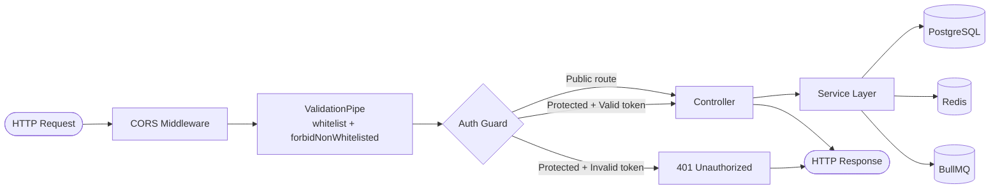

# 07 — Flowcharts

## 1. User Authentication Decision Flow

---

## 2. Product Creation Decision Flow

---

## 3. Affiliate Redirect Decision Flow

---

## 4. Link Generation Decision Flow

---

## 5. Daily Price Refresh Process Flow

---

## 6. Campaign Status State Machine

---

## 7. Request Processing Pipeline

