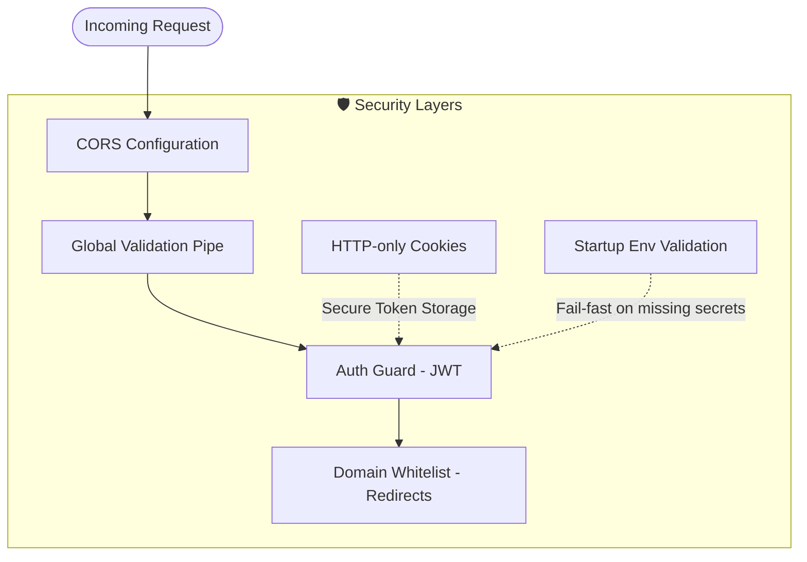
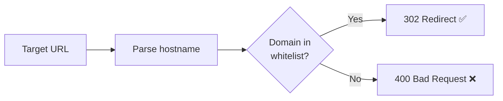

# 08 — Security

## 1. Security Overview



---

## 2. Authentication

### 2.1 JWT Token Strategy

| Token | Storage | Lifetime | Purpose |
|-------|---------|----------|---------|
| **Access Token** | HTTP-only cookie | 15 minutes | Authenticate API requests |
| **Refresh Token** | HTTP-only cookie + Redis | 7 days | Rotate access tokens |

### 2.2 Cookie Configuration

```typescript
{
  httpOnly: true,              // Not accessible via JavaScript
  secure: process.env.NODE_ENV === 'production',  // HTTPS only in production
  sameSite: 'strict',          // Prevents CSRF attacks
  path: '/',
  maxAge: 900000               // 15 min (access), 7 days (refresh)
}
```

### 2.3 Password Security
- Passwords are hashed with **bcrypt** (salt rounds: 10)
- Plaintext passwords are never stored or logged
- Minimum password length: 6 characters

### 2.4 Token Revocation
- Refresh tokens are stored in Redis with TTL
- On logout, the refresh token is deleted from Redis
- Expired tokens are automatically rejected

---

## 3. Input Validation

### 3.1 Global Validation Pipe

Applied in `main.ts` to all incoming requests:

```typescript
app.useGlobalPipes(new ValidationPipe({
  whitelist: true,              // Strip unknown properties
  forbidNonWhitelisted: true,   // Reject requests with unknown properties
}));
```

### 3.2 DTO Validation Summary

| DTO | Validators Used |
|-----|----------------|
| `LoginDto` | `@IsString()`, `@MinLength(3)` (username), `@MinLength(6)` (password) |
| `RegisterDto` | Same as LoginDto |
| `CreateProductDto` | `@IsOptional()`, `@IsUrl()` (shopee_url, lazada_url) |
| `UpdateProductDto` | `@IsOptional()`, `@IsString()` (title) |
| `CreateCampaignDto` | `@IsString()`, `@IsDateString()` (start_at, end_at) |
| `CreateLinkDto` | `@IsUUID()` (product_id, campaign_id) |

---

## 4. Secure Redirects

### 4.1 Domain Whitelist

The redirect controller validates target URLs against an allowlist of known marketplace domains:

```typescript
const ALLOWED_DOMAINS = [
  'shopee.co.th',
  'lazada.co.th',
];
```

- Subdomains are allowed (e.g., `www.shopee.co.th`)
- Non-whitelisted domains return **400 Bad Request**
- Prevents **open redirect attacks** where attackers could craft links to malicious sites

### 4.2 Redirect Flow Security



---

## 5. Environment Variable Security

### 5.1 Startup Validation

The application validates critical environment variables at startup (`config/env.validation.ts`):

| Variable | Required | Purpose |
|----------|----------|---------|
| `DATABASE_URL` | ✅ | PostgreSQL connection |
| `REDIS_HOST` | ✅ | Redis connection |
| `REDIS_PORT` | ✅ | Redis connection |
| `JWT_ACCESS_SECRET` | ✅ | Access token signing |
| `JWT_REFRESH_SECRET` | ✅ | Refresh token signing |

If any are missing, the application **fails to start** with a clear error message.

### 5.2 Secret Management

| Practice | Status |
|----------|--------|
| `.env` in `.gitignore` | ✅ |
| `.env.example` with placeholder values | ✅ |
| No hardcoded secrets in source | ✅ |
| JWT secrets from env vars only | ✅ |

---

## 6. CORS Configuration

```typescript
app.enableCors({
  origin: true,
  credentials: true,
});
```

- `credentials: true` allows cookies to be sent cross-origin
- In production, `origin` should be restricted to the frontend domain

---

## 7. Route Protection Summary

| Route Pattern | Protection | Method |
|---------------|-----------|--------|
| `POST /api/auth/login` | Public | — |
| `POST /api/auth/register` | Public | — |
| `POST /api/auth/refresh` | Cookie | Refresh token validation |
| `GET /api/products` | Auth Guard | JWT access token |
| `POST /api/products` | Auth Guard | JWT access token |
| `GET /api/campaigns` | Auth Guard | JWT access token |
| `POST /api/campaigns` | Auth Guard | JWT access token |
| `GET /api/links` | Auth Guard | JWT access token |
| `POST /api/links` | Auth Guard | JWT access token |
| `GET /api/dashboard` | Auth Guard | JWT access token |
| `GET /go/:code` | Public | Domain whitelist only |

---

## 8. Security Checklist

| # | Item | Status |
|---|------|--------|
| 1 | Passwords hashed (bcrypt) | ✅ |
| 2 | JWT in HTTP-only cookies | ✅ |
| 3 | SameSite=strict cookies | ✅ |
| 4 | Secure cookies in production | ✅ |
| 5 | Input validation (class-validator) | ✅ |
| 6 | Whitelist-only DTO properties | ✅ |
| 7 | Env variable validation at startup | ✅ |
| 8 | No secrets in source code | ✅ |
| 9 | `.env` gitignored | ✅ |
| 10 | Domain whitelist for redirects | ✅ |
| 11 | Auth guard on all admin routes | ✅ |
| 12 | Refresh token revocation | ✅ |
